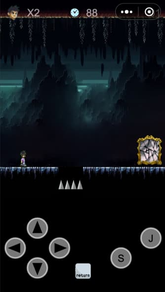

# 寻爱迷踪
伯衡君创作的这款《寻爱迷踪》小游戏，创作初衷是看到了世界上的婚姻崩裂的越来越多，而结婚率却逐渐降低，如果最重要分开，为何当初还要在一起？我做这个游戏的想法很简单，只是想让玩家在玩这个游戏的时候，能够或多或少触碰到其深层回忆，回忆起情侣二人曾经在人世间各个场合的喜悲，尽可能延续挽回即将分开的情侣，珍惜眼前人，让这份感情直到永远，使用微信小游戏开发工具开发。

### 游戏封面截图

### 游戏玩法

- 采用的形式是横版街机过关形式，共设置了12关，解开谜题，通过关卡，即可通关。
- 通过左右移动键点击移动，S键是发射瞬移波，当瞬移波移动的时候再按下 S 键可以让主人公瞬移到瞬移波所在的地方，J 键是跳跃。中间的 return 键是返回上一层页面。
- 发挥你的聪明才智，通过一个个熟悉的情景，回忆起过去的美好。
- 有两个限制，生命总量——2次，时间限制——90秒，生命总量为0则是重新开始游戏，时间限制为0后则损失生命1次。

### 制作过程

1. 使用微信小游戏开发工具创建项目。
2. 设计游戏界面，包括背景、角色、障碍物等。
3. 编写游戏逻辑，包括角色跳跃、障碍物生成、碰撞检测等。
4. 测试游戏，修复bug，优化游戏体验。
5. 上传游戏到微信小游戏平台，发布游戏。

### 经验分享

- 角色、封面和场景，使用 AI 生成图片，提高了工作效率
- 音乐可以用 Suno 等 AI 生成，几乎完成了之前无法完成的工作

### 游戏内容截图

### 微信扫一扫试玩
